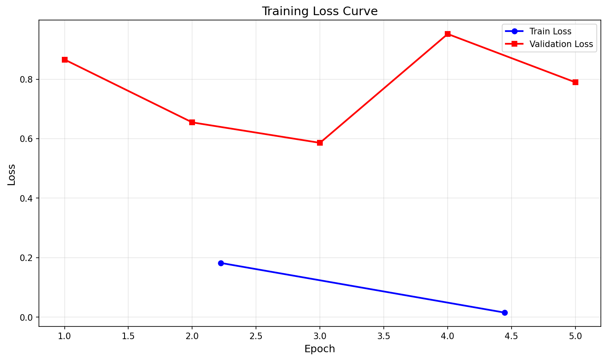
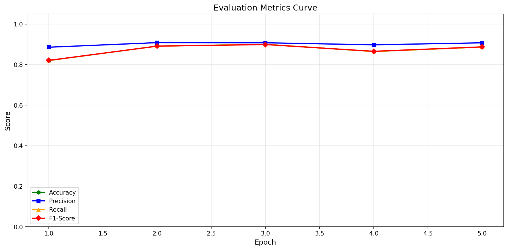
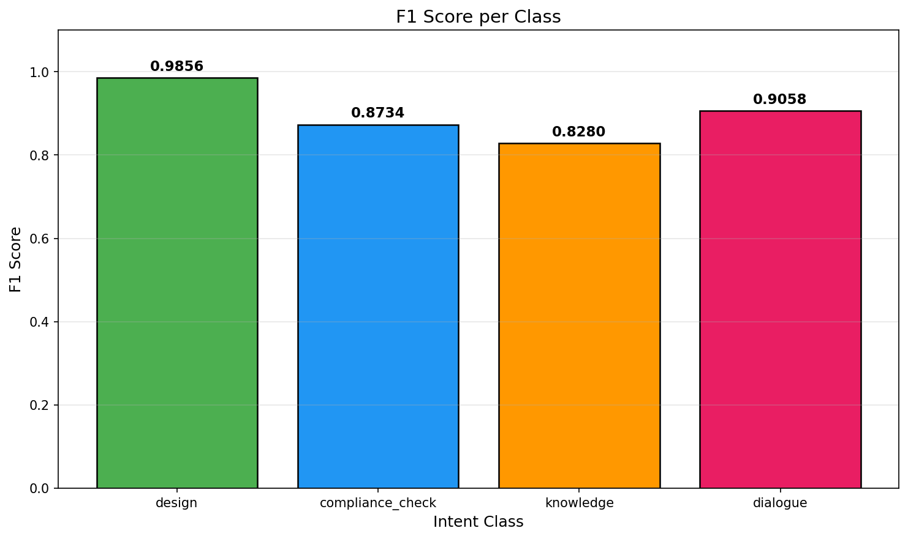
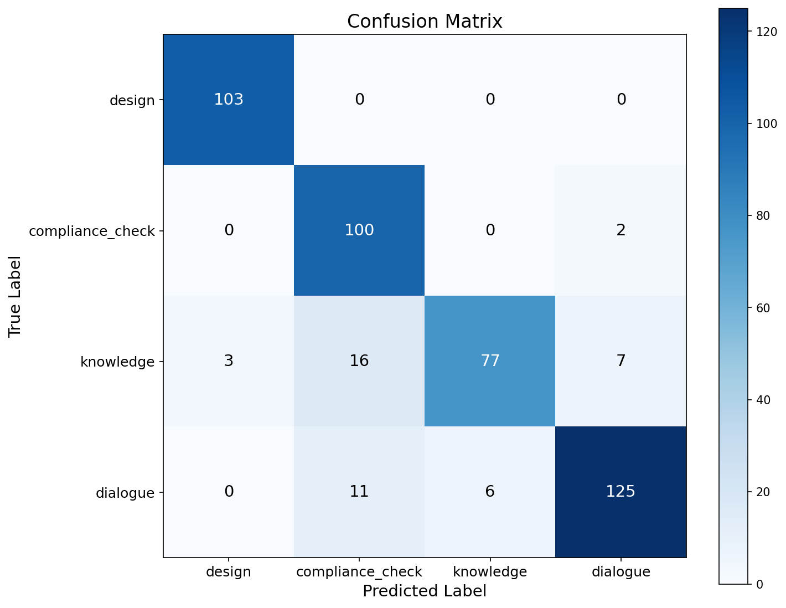

# Intent Recognition BERT Model

意图识别模型 - 基于 BERT 的中文意图四分类系统

## Model Overview

This is a fine-tuned BERT model for intent classification in Chinese, specifically designed for Hanfu (traditional Chinese clothing) related queries.

### Intent Classes
- `design`: Design-related queries
- `compliance_check`: Compliance and ritual checking
- `knowledge`: Knowledge and historical questions
- `dialogue`: Casual conversation

## Evaluation Results

### Overall Performance

| Metric | Score |
|--------|-------|
| Accuracy | 90.00% |
| Precision | 0.9076 |
| Recall | 0.9000 |
| F1-Score | 0.8989 |

### Training Curves





### Classification Details





### Per-Class Metrics

| Class | Precision | Recall | F1-Score | Support |
|-------|-----------|--------|-----------|---------|
| design | 0.9717 | 1.0000 | 0.9856 | 103 |
| compliance_check | 0.7874 | 0.9804 | 0.8734 | 102 |
| knowledge | 0.9277 | 0.7476 | 0.8280 | 103 |
| dialogue | 0.9328 | 0.8803 | 0.9058 | 142 |

### Training Parameters

| Parameter | Value |
|-----------|-------|
| Learning Rate | 2e-05 |
| Batch Size | 8 |
| Epochs | 5 |
| Weight Decay | 0.01 |

## Quick Start

### Installation

```bash
pip install -r requirements.txt
```

### Usage

#### 1. Download the Model

First, you need to download the fine-tuned model. You can train it yourself using `train_intent_p4.py` or obtain it from the model release.

#### 2. Use the Intent Classifier

```python
from intent_classifier import IntentClassifier

# Initialize the classifier
classifier = IntentClassifier(model_path="./intent-model-final-p4")

# Predict intent
result = classifier.predict("我想设计一件汉服，有什么建议？")
print(f"Intent: {result['intent']}")
print(f"Confidence: {result['confidence']:.2%}")
```

## Training

If you want to train the model yourself:

```bash
python train_intent_p4.py
```

The trained model will be saved to `./intent-model-final-p4/`.

## Files

| File | Description |
|------|-------------|
| `intent_classifier.py` | Inference module for intent classification |
| `train_intent_p4.py` | Training script (GPU-optimized) |
| `download_model.py` | Script to download pre-trained model |
| `train.json` / `test.json` | Training and test data |
| `requirements.txt` | Python dependencies |

## Model Performance

- Model: `bert-base-chinese`
- Accuracy: ~90%+ (depending on dataset)
- 4 intent classes

## License

This project is for educational and research purposes.
